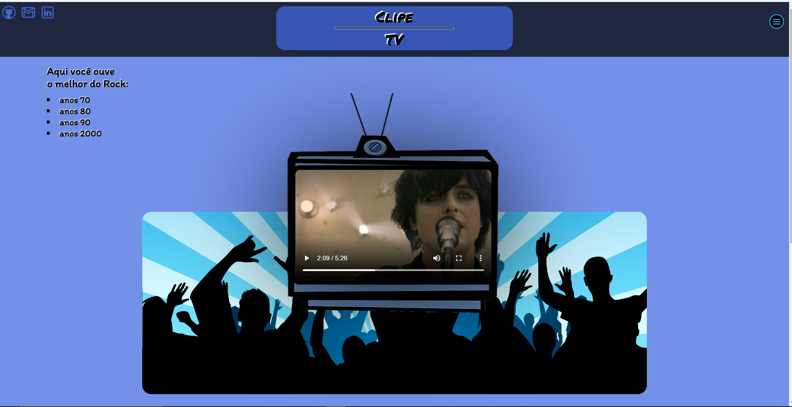

><h1>Clipe-Tv</h1>

<h2 align="center">
  Acesse o Clipe-Tv Clicando <a target="_blank" href="https://erick-sarges.github.io/Clip-TV/">AQUI</a>!
</h2>

  <b>Sobre o Projeto | Tecnologias</b>

## :clipboard: Sobre o Projeto
Esse projeto é um site minimalista para assistir videoclipes.

## :computer: Tecnologias utilizadas
O projeto foi desenvolvido utilizando as seguintes tecnologias:
- <b>HTML</b>
- <b>CSS</b>